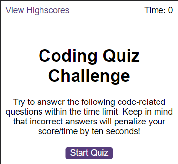
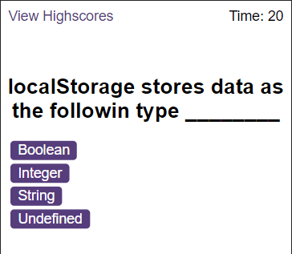
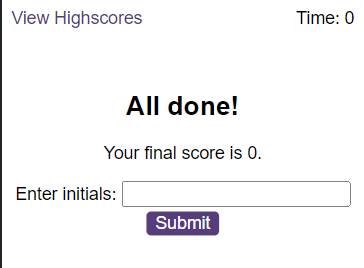
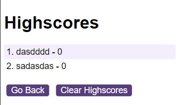

# Code-Quiz

## Description

This website was created with the objective of practicing the new learn javascript API using DOM, events and localStorage.
The Code Quiz Application, brings a interactive experience in a Web page, by learning and testing your knowlege.

**Note:** This project is still under development and will receive updates related to refactoring in the javascript files to make it Modular.

## instalation

N/A

## Usage

* Start the game by pressing in the button Start Quiz  

* The question show's up and you have a timer to choose the right answer, if you get the wrong one you lose 10 seconds on the clock.  

* After answering all questions or the time runs out, you will see your score and a box to put your name so you can be in the scores and see the other scores.  

* In the Scores page you can see all scores  

## Credits

N/A

## License

Available under the MIT license. See the LICENSE file for more info.

## Test

[Deployed application](https://guilhermederetti.github.io/Code-Quiz/)
